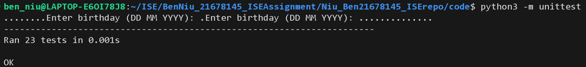

| Item       | Value            |
| ---------- | ---------------- |
| Assessment | Final assessment |
| Name       | Ben Niu          |
| Student ID | 21678145         |
| Practical class | 24/05/2024 11:59pm |

# Introduction

This assessment implements tools useful in numerology analysis, including life path number calculator and generation finder.

# Module descriptions

This assessment contains 2 tools needed to implement. They have the same input like birthday. So I design 3 modules:

- common.py: implement common functions, like handling birthday input, parsing birthday.
- life_path_number.py: the entrance and logic code for calculating life path number.
- generation.py: the entrance and logic code for finding generation.

## common.py

This module provides common functions include handling input/output and parsing birthday.

### get_birthday_from_input()

Submodule get_birthday_from_input  
Imports: none  
Exports: birthday_str (string)  

This function reads 1 birthday string or 2 birthday strings (string) from keyboard as user input. Then it returns the string directly.

### get_birthday_from_file(file_name)

Submodule get_birthday_from_file  
Imports: file_name (string)  
Exports: birthday_str (string)  

This function reads a line which contains 1 birthday string or 2 birthday strings (string) from a text file. Then it returns the string directly.

### write_output_to_console(output)

Submodule write_output_to_console  
Imports: output (string)  
Exports: none  

This function prints the output string on the screen.

### write_output_to_file(output, file_name)

Submodule write_output_to_file  
Imports: output (string), file_name (string)  
Exports: result (boolean)  

This function writes the output string to a file with the name of file name.

### convert_birthdays(birthdays_str)

Submodule convert_birthdays  
Imports: birthdays_str (string)  
Exports: [(day, month, year)] (list)  

This function converts the input birthday strings to an array of (date, month, year).  
The max input available birthday is 2.

### convert_birthday(birthday_str)

Submodule convert_birthday  
Imports: birthday_str (string)  
Exports: (day, month, year) (integers in a tuple)  

This function converts the input string to a integer tuple of (date, month, year).

### verify_year(year)

Submodule verify_year  
Imports: year (integer)  
Exports: year (integer)  

This function verify the year and return a valid year integer value.  
The year must between 1901 and 2024, others return -1.

### verify_month(month)

Submodule verify_month  
Imports: month (integer)  
Exports: month (integer)  

This function verify the month and return a valid month integer value.  
The month should between 1 and 12, others return -1.

### verify_day(day)

Submodule verify_day  
Imports: day (integer)  
Exports: day (integer)  

This function verify the day and return a valid day integer value.  
The day should between 1 and 31, others return -1.
Assumption: we assume every month has 31 days, do not consider 30 days for April or 28/29 days for February.

### convert_month_str(month_str)

Submodule convert_month_str  
Imports: month_str (string)  
Exports: month (integer)  

This function convert the different type of month string to month (integer).  
Like convert "Jan" or "January" to 1.

# Modularity

## Review checklist

| Item | Checklist question relate to modularity | Yes/No | Description of the issue if No is the answer |
| :--: | --------------------------------------- | :----: | -------------------------------------------- |
| 1 | Is the system free of global variables? |  |  |
| 2 | Is each submodule free of control flags? |  |  |
| 3 | Does each submodule perform one well-defined task? |  |  |
| 4 | Does each submodule have less than 6 parameters? |  |  |
| 5 | Do the parts of each submodule deal with the same data? |  |  |
| 6 | Is the system free of duplicate submodules? |  |  |
| 7 | Do different submodules perform non-overlapping tasks? |  |  |

### Review common.py

| Item | Checklist question relate to modularity | Yes/No | Description of the issue if No is the answer |
| :--: | --------------------------------------- | :----: | -------------------------------------------- |
| 1 | Is the system free of global variables? | No |  |
| 2 | Is each submodule free of control flags? | No |  |
| 3 | Does each submodule perform one well-defined task? | No |  |
| 4 | Does each submodule have less than 6 parameters? | No |  |
| 5 | Do the parts of each submodule deal with the same data? | No |  |
| 6 | Is the system free of duplicate submodules? | No |  |
| 7 | Do different submodules perform non-overlapping tasks? | No |  |

# Black-box test cases

## BB for common.py

### BB for get_birthday_from_input()

#### EP for get_birthday_from_input()

| No | Category | Test Data | Expected Result |
| -- | -------- | --------- | --------------- |
| 1 | input any string | input: "20 May 2024" | "20 May 2024" |

#### BVA for get_birthday_from_input()

Not applicable

### BB for get_birthday_from_file(file_name)

#### EP for get_birthday_from_file(file_name)

| No | Category | Test Data | Expected Result |
| -- | -------- | --------- | --------------- |
| 1 | input any string from file | file input: "20 May 2024" | "20 May 2024" |

#### BVA for get_birthday_from_file(file_name)

Not applicable

### BB for write_output_to_console(output)

#### EP for write_output_to_console(output)

| No | Category | Test Data | Expected Result |
| -- | -------- | --------- | --------------- |
| 1 | output any string | "Hello world!" | output: "Hello world!" |

#### BVA for write_output_to_console(output)

Not applicable

### BB for write_output_to_file(output, file_name)

#### EP for write_output_to_file(output, file_name)

| No | Category | Test Data | Expected Result |
| -- | -------- | --------- | --------------- |
| 1 | output any string | "Hello world!" | result: True file output: "Hello world!" |

#### BVA for write_output_to_file(output, file_name)

Not applicable

### BB for convert_birthdays(birthdays_str)

#### EP for convert_birthdays(birthdays_str)

| No | Category | Test Data | Expected Result |
| -- | -------- | --------- | --------------- |
| 1 | invalid input | "" | [] |
| 2 | 1 available birthday | "20 May 2024" | [(20, 5, 2024)] |
| 3 | 2 available birthdays | "20 May 2024 01 01 2024" | [(20, 5, 2024), (1, 1, 2024)] |
| 4 | more than 2 birthdays | "1 1 2024 1 1 2024 1 1 2024" | [] |

#### BVA for convert_birthdays(birthdays_str)

Not applicable

### BB for convert_birthday(birthday_str)

#### EP for convert_birthday(birthday_str)

| No | Category | Test Data | Expected Result |
| -- | -------- | --------- | --------------- |
| 1 | invalid year | "20 May 0" | throw exception |
| 2 | invalid month | "20 ABC 2024" | throw exception |
| 3 | invalid day | "0 May 2024" | throw exception |
| 4 | invalid year and month | "20 ABC 10000" | throw exception |
| 5 | invalid year and day | "100 May 100" | throw exception |
| 6 | invalid month and day | "32 Month 2024" | throw exception |
| 7 | invalid year and month and day | "" | throw exception |
| 8 | null input | None | throw exception |
| 9 | month is short name | "20 Jan 2024" | (20, 1, 2024) |
| 10 | month is long name | "20 January 2024" | (20, 1, 2024) |
| 11 | month is number | "20 01 2024" | (20, 1, 2024) |

#### BVA for convert_birthday(birthday_str)

Not applicable

### BB for verify_year(year)

#### EP for verify_year(year)

| No | Category | Test Data | Expected Result |
| -- | -------- | --------- | --------------- |
| 1 | year < 1901 | 1000 | -1 |
| 2 | 1901 <= year <= 2024 | 1957 | 1957 |
| 3 | year > 2024 | 3000 | -1 |

#### BVA for verify_year(year)

| No | Boundary | Test Data | Expected Result |
| -- | -------- | --------- | --------------- |
| 1 | invalid available | 1900 1901 | -1 1901 |
| 2 | available invalid | 2024 2025 | 2024 -1 |

### BB for verify_month(month)

#### EP for verify_month(month)

| No | Category | Test Data | Expected Result |
| -- | -------- | --------- | --------------- |
| 1 | month < 1 | -10 | -1 |
| 2 | 1 <= month <= 12 | 11 | 11 |
| 3 | month > 12 | 20 | -1 |

#### BVA for verify_month(month)

| No | Boundary | Test Data | Expected Result |
| -- | -------- | --------- | --------------- |
| 1 | invalid available | 0 1 | -1 1 |
| 2 | available invalid | 12 13 | 12 -1 |

### BB for verify_day(day)

#### EP for verify_day(day)

| No | Category | Test Data | Expected Result |
| -- | -------- | --------- | --------------- |
| 1 | day < 1 | -10 | -1 |
| 2 | 1 <= day <= 31 | 11 | 11 |
| 3 | day > 31 | 40 | -1 |

#### BVA for verify_day(day)

| No | Boundary | Test Data | Expected Result |
| -- | -------- | --------- | --------------- |
| 1 | invalid available | 0 1 | -1 1 |
| 2 | available invalid | 31 32 | 31 -1 |

### BB for convert_month_str(month_str)

#### EP for convert_month_str(month_str)

| No | Category | Test Data | Expected Result |
| -- | -------- | --------- | --------------- |
| 1 | invalid month | "ABC" | -1 |
| 2 | empty input | "" | -1 |
| 3 | null input | None | -1 |
| 4 | month is short name | "Jan" | 1 |
| 5 | month is long name | "January" | 1 |
| 6 | month is number | "01" | 1 |

#### BVA for convert_month_str(month_str)

Not applicable

# White-box test cases

## WB for common.py

### WB for get_birthday_from_input()

| No | Path | Test Data | Expected Result |
| -- | -------- | --------- | --------------- |
| 1 | Direct through | input: "20 May 2024" | "20 May 2024" |

### WB for get_birthday_from_file(file_name)

| No | Path | Test Data | Expected Result |
| -- | -------- | --------- | --------------- |
| 1 | success | file input: "20 May 2024" | "20 May 2024" |
| 2 | exception | input file is bad | "" |

### WB for write_output_to_console(output)

| No | Path | Test Data | Expected Result |
| -- | -------- | --------- | --------------- |
| 1 | Direct through | "Hello world!" | output: "Hello world!" |

### WB for write_output_to_file(output, file_name)

| No | Path | Test Data | Expected Result |
| -- | -------- | --------- | --------------- |
| 1 | success | "Hello world!" | result: True file output: "Hello world!" |
| 2 | exception | file_name: "" | result: False |

### WB for convert_birthdays(birthdays_str)

| No | Path | Test Data | Expected Result |
| -- | -------- | --------- | --------------- |
| 1 | DO NOT enter the 1st if | None | [] |
| 2 | Enter the 1st if but not the 2nd if | "20 May" | [] |
| 3 | Enter the 1st and the 2nd if | "20 May 2024" | [(20, 5, 2024)] |
| 4 | Enter the 1st and exception | "20 ABC 2024" | [] |

### WB for convert_birthday(birthday_str)

| No | Path | Test Data | Expected Result |
| -- | -------- | --------- | --------------- |
| 1 | DO NOT enter the 1st if | None | throw exception |
| 2 | Enter the 1st if but not the 2nd if | "20 May" | throw exception |
| 3 | Enter the 1st and the 2nd if but not the 3rd if | "20 ABC 2024" | throw exception |
| 4 | Enter the 1st and the 2nd and the 3rd if | "20 May 2024" | (20, 5, 2024) |

### WB for verify_year(year)

| No | Path | Test Data | Expected Result |
| -- | -------- | --------- | --------------- |
| 1 | Enter if | 2000 | 2000 |
| 2 | Skip if | 1900 | -1 |

### WB for verify_month(month)

| No | Path | Test Data | Expected Result |
| -- | -------- | --------- | --------------- |
| 1 | Enter if | 2 | 2 |
| 2 | Skip if | 0 | -1 |

### WB for verify_day(day)

| No | Path | Test Data | Expected Result |
| -- | -------- | --------- | --------------- |
| 1 | Enter if | 2 | 2 |
| 2 | Skip if | 0 | -1 |

### WB for convert_month_str(month_str)

| No | Path | Test Data | Expected Result |
| -- | -------- | --------- | --------------- |
| 1 | Do not enter 1st layer exception | "Jan" | 1 |
| 2 | Enter 1st layer exception but not 2nd exception | "January" | 1 |
| 3 | Enter 1st and 2nd layer ecxeption but not 3rd exception | "1" | 1 |
| 4 | Enter 1st and 2nd and 3rd layer ecxeption | "TEST" | -1 |

# Test implementation and test execution

## Test for common.py

### How to run test for common.py

Use command "python3 test_common.py" or "python3 -m unittest test_common.py" to execute test case.  
All testcases passed.

# Traceability matrix

| Module name | BB (EP) | BB (BVA) | WB | Data type/s | Form of input/output | EP | BVA | Wite-Box |
| ----------- | ------- | -------- | -- | ----------- | -------------------- | -- | --- | -------- |
| common.get_birthday_from_input | Done | NA | Done | string | imports: none, exports: birthday_str (string) | Done | NA | Done |
| common.get_birthday_from_file | Done | NA | Done | string | imports: file_name (string), exports: birthday_str (string) | Done | NA | Done |
| common.write_output_to_console | Done | NA | Done | string | imports: output (string), exports: none | Done | NA | Done |
| common.write_output_to_file | Done | NA | Done | string, boolean | imports: output (string), file_name (string), exports: result (boolean) | Done | NA | Done |
| common.convert_birthdays | Done | NA | Done | string, list | imports: birthdays_str (string), exports: [(day, month, year)] (list) | Done | NA | Done |
| common.convert_birthday | Done | NA | Done | string, tuple | imports: birthday_str (string), exports: (day, month, year) (tuple) | Done | NA | Done |
| common.verify_year | Done | Done | Done | integer | imports: year (integer), exports: year (interger) | Done | Done | Done |
| common.verify_month | Done | Done | Done | integer | imports: month (integer), exports: month (integer) | Done | Done | Done |
| common.verify_day | Done | Done | Done | integer | imports: day (integer), exports: day (integer) | Done | Done | Done |
| common.convert_month_str | Done | NA | Done | string, integer | imports: month_str (string), month (integer) | Done | NA | Done |

# Version control

I create an empty repo and upload initial files to master branch.  
I will create 3 branches to develop different modules:  

- Branch "common" is used to develop common modules and methods and test code.  
- Branch "life_path" is used to develop life path number calculator and test code.  
- Branch "generation" is used to develop generation finder and test code.

After developed complete, merge back patches to master branch.

# Discusstion
