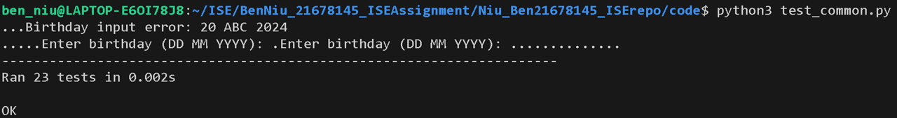

| Item       | Value            |
| ---------- | ---------------- |
| Assessment | ISE final assessment |
| Name       | Ben Niu          |
| Student ID | 21678145         |
| Practical class | 24/05/2024 11:59pm |

# Introduction

This assessment implements tools useful in numerology analysis, including life path number calculator and generation finder.  
This assessment follows the basic concepts of version controlling, modularity and software testing including black box and white box test design and implementation.

# Module Description

This assessment contains 2 tools needed to implement. They have the same input like birthday. So I design 3 modules:

- common.py: implement common functions, like handling birthday input, parsing birthday.
- life_path_number.py: the entrance and logic code for calculating life path number.
- generation.py: the entrance and logic code for finding generation.

## common.py

This module provides common functions include handling input/output and parsing birthday.

### get_birthday_from_input()

Submodule get_birthday_from_input  
Imports: none  
Exports: birthday_str (string)  

This function reads 1 birthday string or 2 birthday strings (string) from keyboard as user input.  
Then it returns the string directly.

### get_birthday_from_file(file_name)

Submodule get_birthday_from_file  
Imports: file_name (string)  
Exports: birthday_str (string)  

This function reads a line which contains 1 birthday string or 2 birthday strings (string) from a text file.  
Then it returns the string directly.

### write_output_to_console(output)

Submodule write_output_to_console  
Imports: output (string)  
Exports: none  

This function prints the output string on the screen.

### write_output_to_file(output, file_name)

Submodule write_output_to_file  
Imports: output (string), file_name (string)  
Exports: result (boolean)  

This function writes the output string to a file with the name of file name.

### convert_birthdays(birthdays_str)

Submodule convert_birthdays  
Imports: birthdays_str (string)  
Exports: [(day, month, year)] (list)  

This function converts the input birthday strings to an array of (date, month, year).  
The max input available birthday is 2.

### convert_birthday(birthday_str)

Submodule convert_birthday  
Imports: birthday_str (string)  
Exports: (day, month, year) (integers in a tuple)  

This function converts the input string to a integer tuple of (date, month, year).

### verify_year(year)

Submodule verify_year  
Imports: year (integer)  
Exports: year (integer)  

This function verify the year and return a valid year integer value.  
The year must between 1901 and 2024, others return -1.

### verify_month(month)

Submodule verify_month  
Imports: month (integer)  
Exports: month (integer)  

This function verify the month and return a valid month integer value.  
The month should between 1 and 12, others return -1.

### verify_day(day)

Submodule verify_day  
Imports: day (integer)  
Exports: day (integer)  

This function verify the day and return a valid day integer value.  
The day should between 1 and 31, others return -1.  
Assumption: we assume every month has 31 days, do not consider 30 days for April or 28/29 days for February.

### convert_month_str(month_str)

Submodule convert_month_str  
Imports: month_str (string)  
Exports: month (integer)  

This function convert the different type of month string to month (integer).  
Like convert "Jan" or "January" to 1.

## generation.py

This module contains the entrance and logic code for finding generation.

### get_generation(year)

Submodule get_generation  
Imports: year (integer)  
Exports: generation_str (string)  

This function returns the corresponding generation by input year (integer).  
The year must between 1901 and 2024, others return None.

### main(input_file, output_file)

Submodule main  
Imports: input_file (string), output_file (string)  
Exports: result (boolean)  

This function is the main function of generation finder.  
You can specify input_file and output_file to read from/write to files.  
If you want input through console, leave parameters as None.

## life_path_number.py

This module contains the entrance and logic code for calculating life path number.

### calc_life_path_number(day, month, year)

Submodule calc_life_path_number  
Imports: day (integer), month (integer), year (integer)  
Exports: lp_number (integer)  

This function used to calculate life path number.

### add_digists(number)

Submodule add_digists  
Imports: number (integer)  
Exports: single_digist (int)  

This function used to calculate single digist from a number.

### is_master_number(number)

Submodule is_master_number  
Imports: number (integer)  
Exports: result (boolean)  

This function used to check the number is a master number or not.

### get_lucky_colour(number)

Submodule get_lucky_colour  
Imports: number (integer)  
Exports: lucky_colour (string)  

This function used to get lucky colour from the life path number.

### main(input_file, output_file)

Submodule main  
Imports: input_file (string), output_file (string)  
Exports: result (boolean)  

This function is the main function of life path number calculator.  
You can specify input_file and output_file to read from/write to files.  
If you want input through console, leave parameters as None.

# Modularity

## User guide

### Generation tool

Use command "python3 generation.py" to input birthday through keyboard and get generation result in console.

- e.g., run command: python3 generation.py -> keyboard input: "20 May 2024" -> Get result in display

Use command "python3 generation.py INPUT_FILE OUTPUT_FILE" to input birthday through input file and get result in output file.

- e.g., run command: python3 generation.py generation_input.txt generation_output.txt

### Life path number tool

Use command "python3 life_path_number.py" to input birthday through keyboard and get generation result in console.

- e.g., run command: python3 life_path_number.py -> keyboard input: "20 May 2024" -> Get result in display
- e.g., run command: python3 life_path_number.py -> keyboard input: "20 May 2024 20 May 2024" -> Get result in display

Use command "python3 life_path_number.py INPUT_FILE OUTPUT_FILE" to input birthday through input file and get result in output file.

- e.g., python3 generation.py generation_input.txt generation_output.txt

## How modularity principles are used

Modularity principles include 3 parts: coupling, cohesion, code redundancy.  
After analyzing the specification, I design the modules (files) and submodules (functions) as below:  

I designed 3 modules following low coupling and high cohesion.  
Each module has independent responsibility and contains several submodules which contain very simple and small piece of code.  
These simple methods could work together to implement complex functionality and are useful to reduce code redundancy.

- common.py implements all functions interact with input (console/file) and output (console/file), and handle the date string.
- generation.py implements get generation function and provides main function as tool entrance.
- life_path_number.py implements related functions and provides main function as tool entrance.

## Review checklist

The checklist is designed following low coupling, high cohesion and no redundancy.  
After reviewed production code using this checklist, all modules passed and followed modularity principles.

| Item | Checklist question relate to modularity | Yes/No | Description of the issue if No is the answer |
| :--: | --------------------------------------- | :----: | -------------------------------------------- |
| 1 | Is the system free of global variables? |  |  |
| 2 | Is each submodule free of control flags? |  |  |
| 3 | Does each submodule perform one well-defined task? |  |  |
| 4 | Does each submodule have less than 6 parameters? |  |  |
| 5 | Do the parts of each submodule deal with the same data? |  |  |
| 6 | Is the system free of duplicate submodules? |  |  |
| 7 | Do different submodules perform non-overlapping tasks? |  |  |

### Review common.py

| Item | Checklist question relate to modularity | Yes/No | Description of the issue if No is the answer |
| :--: | --------------------------------------- | :----: | -------------------------------------------- |
| 1 | Is the system free of global variables? | No |  |
| 2 | Is each submodule free of control flags? | No |  |
| 3 | Does each submodule perform one well-defined task? | No |  |
| 4 | Does each submodule have less than 6 parameters? | No |  |
| 5 | Do the parts of each submodule deal with the same data? | No |  |
| 6 | Is the system free of duplicate submodules? | No |  |
| 7 | Do different submodules perform non-overlapping tasks? | No |  |

### Review generation.py

| Item | Checklist question relate to modularity | Yes/No | Description of the issue if No is the answer |
| :--: | --------------------------------------- | :----: | -------------------------------------------- |
| 1 | Is the system free of global variables? | No |  |
| 2 | Is each submodule free of control flags? | No |  |
| 3 | Does each submodule perform one well-defined task? | No |  |
| 4 | Does each submodule have less than 6 parameters? | No |  |
| 5 | Do the parts of each submodule deal with the same data? | No |  |
| 6 | Is the system free of duplicate submodules? | No |  |
| 7 | Do different submodules perform non-overlapping tasks? | No |  |

### Review life_path_number.py

| Item | Checklist question relate to modularity | Yes/No | Description of the issue if No is the answer |
| :--: | --------------------------------------- | :----: | -------------------------------------------- |
| 1 | Is the system free of global variables? | No |  |
| 2 | Is each submodule free of control flags? | No |  |
| 3 | Does each submodule perform one well-defined task? | No |  |
| 4 | Does each submodule have less than 6 parameters? | No |  |
| 5 | Do the parts of each submodule deal with the same data? | No |  |
| 6 | Is the system free of duplicate submodules? | No |  |
| 7 | Do different submodules perform non-overlapping tasks? | No |  |

# Test Design (Black Box)

I designed black box test cases for each module and each function.  
Black box contains 2 approches: EP and BVA.  
All functions implement EP case, only some functions implement BVA because some functions don't have "boundary".

- Title "BB for common.py" means black box design for module: common.py.
- Title "BB for get_birthday_from_input()" means black box design for function: get_birthday_from input().
- Title "EP for get_birthday_from_input()" means equivalence partitioning case for function: get_birthday_from input().
- Title "BVA for get_birthday_from_input()" means boundary value analysis case for function: get_birthday_from input().

## BB for common.py

### BB for get_birthday_from_input()

#### EP for get_birthday_from_input()

| No | Category | Test Data | Expected Result |
| -- | -------- | --------- | --------------- |
| 1 | input any string | input: "20 May 2024" | "20 May 2024" |

#### BVA for get_birthday_from_input()

Not applicable

### BB for get_birthday_from_file(file_name)

#### EP for get_birthday_from_file(file_name)

| No | Category | Test Data | Expected Result |
| -- | -------- | --------- | --------------- |
| 1 | input any string from file | file input: "20 May 2024" | "20 May 2024" |

#### BVA for get_birthday_from_file(file_name)

Not applicable

### BB for write_output_to_console(output)

#### EP for write_output_to_console(output)

| No | Category | Test Data | Expected Result |
| -- | -------- | --------- | --------------- |
| 1 | output any string | "Niu" | output: "Niu" |

#### BVA for write_output_to_console(output)

Not applicable

### BB for write_output_to_file(output, file_name)

#### EP for write_output_to_file(output, file_name)

| No | Category | Test Data | Expected Result |
| -- | -------- | --------- | --------------- |
| 1 | output any string | "Niu" | result: True file output: "Niu" |

#### BVA for write_output_to_file(output, file_name)

Not applicable

### BB for convert_birthdays(birthdays_str)

#### EP for convert_birthdays(birthdays_str)

| No | Category | Test Data | Expected Result |
| -- | -------- | --------- | --------------- |
| 1 | invalid input | "" | [] |
| 2 | 1 available birthday | "20 May 2024" | [(20, 5, 2024)] |
| 3 | 2 available birthdays | "20 May 2024 01 01 2024" | [(20, 5, 2024), (1, 1, 2024)] |
| 4 | more than 2 birthdays | "1 1 2024 1 1 2024 1 1 2024" | [] |

#### BVA for convert_birthdays(birthdays_str)

Not applicable

### BB for convert_birthday(birthday_str)

#### EP for convert_birthday(birthday_str)

| No | Category | Test Data | Expected Result |
| -- | -------- | --------- | --------------- |
| 1 | invalid year | "20 May 0" | throw exception |
| 2 | invalid month | "20 ABC 2024" | throw exception |
| 3 | invalid day | "0 May 2024" | throw exception |
| 4 | invalid year and month | "20 ABC 10000" | throw exception |
| 5 | invalid year and day | "100 May 100" | throw exception |
| 6 | invalid month and day | "32 Month 2024" | throw exception |
| 7 | invalid year and month and day | "" | throw exception |
| 8 | null input | None | throw exception |
| 9 | month is short name | "20 Jan 2024" | (20, 1, 2024) |
| 10 | month is long name | "20 January 2024" | (20, 1, 2024) |
| 11 | month is number | "20 01 2024" | (20, 1, 2024) |

#### BVA for convert_birthday(birthday_str)

Not applicable

### BB for verify_year(year)

#### EP for verify_year(year)

| No | Category | Test Data | Expected Result |
| -- | -------- | --------- | --------------- |
| 1 | year < 1901 | 1000 | -1 |
| 2 | 1901 <= year <= 2024 | 1957 | 1957 |
| 3 | year > 2024 | 3000 | -1 |

#### BVA for verify_year(year)

| No | Boundary | Test Data | Expected Result |
| -- | -------- | --------- | --------------- |
| 1 | invalid available | 1900 1901 | -1 1901 |
| 2 | available invalid | 2024 2025 | 2024 -1 |

### BB for verify_month(month)

#### EP for verify_month(month)

| No | Category | Test Data | Expected Result |
| -- | -------- | --------- | --------------- |
| 1 | month < 1 | -10 | -1 |
| 2 | 1 <= month <= 12 | 11 | 11 |
| 3 | month > 12 | 20 | -1 |

#### BVA for verify_month(month)

| No | Boundary | Test Data | Expected Result |
| -- | -------- | --------- | --------------- |
| 1 | invalid available | 0 1 | -1 1 |
| 2 | available invalid | 12 13 | 12 -1 |

### BB for verify_day(day)

#### EP for verify_day(day)

| No | Category | Test Data | Expected Result |
| -- | -------- | --------- | --------------- |
| 1 | day < 1 | -10 | -1 |
| 2 | 1 <= day <= 31 | 11 | 11 |
| 3 | day > 31 | 40 | -1 |

#### BVA for verify_day(day)

| No | Boundary | Test Data | Expected Result |
| -- | -------- | --------- | --------------- |
| 1 | invalid available | 0 1 | -1 1 |
| 2 | available invalid | 31 32 | 31 -1 |

### BB for convert_month_str(month_str)

#### EP for convert_month_str(month_str)

| No | Category | Test Data | Expected Result |
| -- | -------- | --------- | --------------- |
| 1 | invalid month | "ABC" | -1 |
| 2 | empty input | "" | -1 |
| 3 | null input | None | -1 |
| 4 | month is short name | "Jan" | 1 |
| 5 | month is long name | "January" | 1 |
| 6 | month is number | "01" | 1 |

#### BVA for convert_month_str(month_str)

Not applicable

## BB for generation.py

### BB for get_generation(year)

#### EP for get_generation(year)

| No | Category | Test Data | Expected Result |
| -- | -------- | --------- | --------------- |
| 1 | year < 1901 | 1000 | None |
| 2 | 1901 <= year <= 1945 | 1940 | "Silent Generation" |
| 3 | 1946 <= year <= 1964 | 1950 | "Baby Boomers" |
| 4 | 1965 <= year <= 1979 | 1970 | "Generation X" |
| 5 | 1980 <= year <= 1994 | 1980 | "Millennials" |
| 6 | 1995 <= year <= 2009 | 2000 | "Generation Z" |
| 7 | 2010 <= year <= 2024 | 2020 | "Generation Alpha" |
| 8 | year > 2024 | 2030 | None |

#### BVA for get_generation(year)

| No | Boundary | Test Data | Expected Result |
| -- | -------- | --------- | --------------- |
| 1 | invalid "Silent Generation" | 1900 1901 | None "Silent Generation" |
| 2 | "Silent Generation" "Baby Boomers" | 1945 1946 | "Silent Generation" "Baby Boomers" |
| 3 | "Baby Boomers" "Generation X" | 1964 1965 | "Baby Boomers" "Generation X" |
| 4 | "Generation X" "Millennials" | 1979 1980 | "Generation X" "Millennials" |
| 5 | "Millennials" "Generation Z" | 1994 1995 | "Millennials" "Generation Z" |
| 6 | "Generation Z" "Generation Alpha" | 2009 2010 | "Generation Z" "Generation Alpha" |
| 7 | "Generation Alpha" invalid | 2024 2025 | "Generation Alpha" None |

### BB for main(input_file, output_file)

#### EP for main(input_file, output_file)

| No | Category | Test Data | Expected Result |
| -- | -------- | --------- | --------------- |
| 1 | console input, success | input: "20 May 2024" | result: True output: contains "Generation Alpha" |
| 2 | console input, fail | input: "20 ABC 2024" | result: False |
| 3 | file input, success | file input: "20 May 2024" | result: True file output: contains "Generation Alpha" |
| 4 | file input, fail | file input: "20 ABC 2024" | result: False |

#### BVA for main(input_file, output_file)

Not applicable

## BB for life_path_number.py

### BB for calc_life_path_number(day, month, year)

#### EP for calc_life_path_number(day, month, year)

| No | Category | Test Data | Expected Result |
| -- | -------- | --------- | --------------- |
| 1 | no master number | 21, 5, 2024 | 7 |
| 2 | have master number but no final master number | 11, 5, 1901 | 9 |
| 3 | final master number | 2, 8, 1990 | 1 |

#### BVA for calc_life_path_number(day, month, year)

Not applicable

### BB for add_digists(number)

#### EP for add_digists(number)

| No | Category | Test Data | Expected Result |
| -- | -------- | --------- | --------------- |
| 1 | input master number | 11 | 11 |
| 2 | input not master number but output master | 1901 | 11 |
| 3 | input simple number | 12 | 3 |
| 4 | input complex number | 1987 | 7 |

#### BVA for add_digists(number)

Not applicable

### BB for is_master_number(number)

#### EP for is_master_number(number)

| No | Category | Test Data | Expected Result |
| -- | -------- | --------- | --------------- |
| 1 | 11 is master number | 11 | True |
| 2 | 22 is master number | 22 | True |
| 3 | 33 is master number | 33 | True |
| 4 | number is not master number | 21 | False |

#### BVA for is_master_number(number)

| No | Boundary | Test Data | Expected Result |
| -- | -------- | --------- | --------------- |
| 1 | not master number master number: 11 | 10 11 | False True |
| 2 | master number: 11 not master number | 11 12 | True False |
| 3 | not master number master number: 22 | 21 22 | False True |
| 4 | master number: 22 not master number | 22 23 | True False |
| 5 | not master number master number: 33 | 32 33 | False True |
| 6 | master number: 33 not master number | 33 34 | True False |

### BB for get_lucky_colour(number)

#### EP for get_lucky_colour(number)

| No | Category | Test Data | Expected Result |
| -- | -------- | --------- | --------------- |
| 1 | lucky colour for life path number 1 | 1 | "Red" |
| 2 | lucky colour for life path number 2 | 2 | "Orange" |
| 3 | lucky colour for life path number 3 | 3 | "Yellow" |
| 4 | lucky colour for life path number 4 | 4 | "Green" |
| 5 | lucky colour for life path number 5 | 5 | "Sky Blue" |
| 6 | lucky colour for life path number 6 | 6 | "Indigo" |
| 7 | lucky colour for life path number 7 | 7 | "Violet" |
| 8 | lucky colour for life path number 8 | 8 | "Magenta" |
| 9 | lucky colour for life path number 9 | 9 | "Gold" |
| 10 | lucky colour for life path number 11 | 11 | "Silver" |
| 11 | lucky colour for life path number 22 | 22 | "White" |
| 12 | lucky colour for life path number 33 | 33 | "Crimson" |
| 13 | lucky colour for no life path number | 0 | None |

#### BVA for get_lucky_colour(number)

| No | Boundary | Test Data | Expected Result |
| -- | -------- | --------- | --------------- |
| 1 | no lucky colour lucky colour for 1~9 | 0 1 | None "Red" |
| 2 | lucky colour for 1~9 no lucky colour | 9 10 | "Gold" None |
| 3 | no lucky colour lucky colour for 11 | 10 11 | None "Silver" |
| 4 | lucky colour for 11 no lucky colour | 11 12 | "Silver" None |
| 5 | no lucky colour lucky colour for 22 | 21 22 | None "White" |
| 6 | lucky colour for 22 no lucky colour | 22 23 | "White" None |
| 7 | no lucky colour lucky colour for 33 | 32 33 | None "Crimson" |
| 8 | lucky colour for 33 no lucky colour | 33 34 | "Crimson" None |

### BB for main(input_file, output_file)

#### EP for main(input_file, output_file)

| No | Category | Test Data | Expected Result |
| -- | -------- | --------- | --------------- |
| 1 | console input, success | input: "20 May 2024" | result: True output: contains "Indigo" |
| 2 | console input, fail | input: "20 ABC 2024" | result: False |
| 3 | file input, success | file input: "20 May 2024" | result: True file output: contains "Indigo" |
| 4 | file input, fail | file input: "20 ABC 2024" | result: False |
| 5 | console input 2 birthdays, same life path number | input: "20 May 2024 20 May 2024" | result: True output: contains "True" |
| 6 | console input 2 birthdays, different life path number | input: "20 May 2024 21 May 2024" | result: True output: contains "False" |

#### BVA for main(input_file, output_file)

Not applicable

# Test Design (White Box)

I designed white box test cases for each module and each function.  
White box test cases are used to cover all pathes.  
All functions implement white box and covered all pathes.  

- Title "WB for common.py" means white box design for module: common.py.
- Title "WB for get_birthday_from_input()" means white box design for function: get_birthday_from input().

## WB for common.py

### WB for get_birthday_from_input()

| No | Path | Test Data | Expected Result |
| -- | ---- | --------- | --------------- |
| 1 | Direct through | input: "20 May 2024" | "20 May 2024" |

### WB for get_birthday_from_file(file_name)

| No | Path | Test Data | Expected Result |
| -- | ---- | --------- | --------------- |
| 1 | success | file input: "20 May 2024" | "20 May 2024" |
| 2 | exception | input file is bad | "" |

### WB for write_output_to_console(output)

| No | Path | Test Data | Expected Result |
| -- | ---- | --------- | --------------- |
| 1 | Direct through | "Ben Niu" | output: "Ben Niu" |

### WB for write_output_to_file(output, file_name)

| No | Path | Test Data | Expected Result |
| -- | ---- | --------- | --------------- |
| 1 | success | "Ben Niu" | result: True file output: "Ben Niu" |
| 2 | exception | file_name: "" | result: False |

### WB for convert_birthdays(birthdays_str)

| No | Path | Test Data | Expected Result |
| -- | ---- | --------- | --------------- |
| 1 | DO NOT enter the 1st if | None | [] |
| 2 | Enter the 1st if but not the 2nd if | "20 May" | [] |
| 3 | Enter the 1st and the 2nd if | "20 May 2024" | [(20, 5, 2024)] |
| 4 | Enter the 1st and exception | "20 ABC 2024" | [] |

### WB for convert_birthday(birthday_str)

| No | Path | Test Data | Expected Result |
| -- | ---- | --------- | --------------- |
| 1 | DO NOT enter the 1st if | None | throw exception |
| 2 | Enter the 1st if but not the 2nd if | "20 May" | throw exception |
| 3 | Enter the 1st and the 2nd if but not the 3rd if | "20 ABC 2024" | throw exception |
| 4 | Enter the 1st and the 2nd and the 3rd if | "20 May 2024" | (20, 5, 2024) |

### WB for verify_year(year)

| No | Path | Test Data | Expected Result |
| -- | ---- | --------- | --------------- |
| 1 | Enter if | 2000 | 2000 |
| 2 | Skip if | 8145 | -1 |

### WB for verify_month(month)

| No | Path | Test Data | Expected Result |
| -- | ---- | --------- | --------------- |
| 1 | Enter if | 2 | 2 |
| 2 | Skip if | 0 | -1 |

### WB for verify_day(day)

| No | Path | Test Data | Expected Result |
| -- | ---- | --------- | --------------- |
| 1 | Enter if | 2 | 2 |
| 2 | Skip if | 0 | -1 |

### WB for convert_month_str(month_str)

| No | Path | Test Data | Expected Result |
| -- | ---- | --------- | --------------- |
| 1 | Do not enter 1st layer exception | "Jan" | 1 |
| 2 | Enter 1st layer exception but not 2nd exception | "January" | 1 |
| 3 | Enter 1st and 2nd layer ecxeption but not 3rd exception | "1" | 1 |
| 4 | Enter 1st and 2nd and 3rd layer ecxeption | "TEST" | -1 |

## WB for generation.py

### WB for get_generation(year)

| No | Path | Test Data | Expected Result |
| -- | ---- | --------- | --------------- |
| 1 | Enter if | 2000 | "Generation Z" |
| 2 | Skip if | 8145 | None |

### WB for main(input_file, output_file)

| No | Path | Test Data | Expected Result |
| -- | ---- | --------- | --------------- |
| 1 | Enter the 1st if part, not enter the 2nd if | file input: "20 ABC 2024" | result=False |
| 2 | Enter the 1st if part, enter the 2nd if, enter the 3rd if, not enter the 4th if | file input: "20 May 2024" output_file="" | result=False |
| 3 | Enter the 1st if part, enter the 2nd if, enter the 3rd if, enter the 4th if | file input: "20 May 2024" output_file available | result=True file output: "Generation Alpha" |
| 4 | Enter the 1st else part, not enter the 2nd if | input: "20 ABC 2024" | result=False |
| 5 | Enter the 1st else part, enter the 2nd if, not enter the 3rd if | input: "20 May 2024" | result=True output: "Generation Alpha" |

## WB for life_path_number.py

### WB for calc_life_path_number(day, month, year)

| No | Path | Test Data | Expected Result |
| -- | ---- | --------- | --------------- |
| 1 | Skip while loop | 1, 1, 2001 | 5 |
| 2 | Enter while loop | 9, 7, 2005 | 5 |

### WB for add_digists(number)

| No | Path | Test Data | Expected Result |
| -- | ---- | --------- | --------------- |
| 1 | Enter 1st if | 11 | 11 |
| 2 | Skip 1st if, enter while loop, enter 2nd if | 1990 | 1 |
| 3 | Skip 1st if, enter while loop, skip 2nd if | 2001 | 3 |
| 4 | Skip 1st if, not enter while loop, skip 2nd if | -1 | 0 |

### WB for is_master_number(number)

| No | Path | Test Data | Expected Result |
| -- | ---- | --------- | --------------- |
| 1 | Direct through | 1 | False |

### WB for get_lucky_colour(number)

| No | Path | Test Data | Expected Result |
| -- | ---- | --------- | --------------- |
| 1 | Enter 1st if | 11 | "Silver" |
| 2 | Enter 1st else enter 2nd if | 1 | "Red" |
| 3 | Enter 1st else skip 2nd if | 0 | None |

### WB for main(input_file, output_file)

| No | Path | Test Data | Expected Result |
| -- | ---- | --------- | --------------- |
| 1 | Enter the 1st if part, skip 1st for and 2nd for and 4th if | file input: "20 ABC 2024" | result=False |
| 2 | Enter the 1st if part, 1st for and 2nd for, enter 2nd if, skip 3nd if, skip 4th if | file input: "20 May 2024" out_file="" | result=False |
| 3 | Enter the 1st if part, 1st for and 2nd for, enter 2nd if, and 3nd if, skip 4th if | file input: "20 May 2024" out_file available | result=True file output: contains "6" |
| 4 | Enter the 1st if part, 1st for and 2nd for, enter 2nd if and 3nd if and 4th if and 5th if | file input: "20 May 2024 20 May 2024" out_file available | result=True file output: contains "True" |
| 5 | Enter the 1st else part, skip 1st for and 2nd for and 4th if | input: "20 ABC 2024" | result=False |
| 6 | Enter the 1st else part, 1st for and 2nd for, enter 2nd else, and 3nd if, skip 4th if | input: "20 May 2024" | result=True output: contains "6" |
| 7 | Enter the 1st else part, 1st for and 2nd for, enter 2nd else skip 3nd if and 4th if and 5th else | input: "20 May 2024 20 May 2024" | result=True output: contains "True" |

# Test Implementation

## Test for common.py

### How to run test for common.py

Use command "python3 test_common.py" or "python3 -m unittest test_common.py" to execute test case.  
All testcases passed.

## Test for generation.py

### How to run test for generation.py

Use command "python3 test_generation.py" or "python3 -m unittest test_generation.py" to execute test case.  
All testcases passed.

## Test for life_path_number.py

### How to run test for life_path_number.py

Use command "python3 test_life_path_number.py" or "python3 -m unittest test_life_path_number.py" to execute test case.  
All testcases passed.

# Traceability Matrix

| Module name | BB (EP) | BB (BVA) | WB | Data type/s | Form of input/output | EP | BVA | Wite-Box |
| ----------- | ------- | -------- | -- | ----------- | -------------------- | -- | --- | -------- |
| common.get_birthday_from_input | Done | NA | Done | string | imports: none, exports: birthday_str (string) | Done | NA | Done |
| common.get_birthday_from_file | Done | NA | Done | string | imports: file_name (string), exports: birthday_str (string) | Done | NA | Done |
| common.write_output_to_console | Done | NA | Done | string | imports: output (string), exports: none | Done | NA | Done |
| common.write_output_to_file | Done | NA | Done | string, boolean | imports: output (string), file_name (string), exports: result (boolean) | Done | NA | Done |
| common.convert_birthdays | Done | NA | Done | string, list | imports: birthdays_str (string), exports: [(day, month, year)] (list) | Done | NA | Done |
| common.convert_birthday | Done | NA | Done | string, tuple | imports: birthday_str (string), exports: (day, month, year) (tuple) | Done | NA | Done |
| common.verify_year | Done | Done | Done | integer | imports: year (integer), exports: year (interger) | Done | Done | Done |
| common.verify_month | Done | Done | Done | integer | imports: month (integer), exports: month (integer) | Done | Done | Done |
| common.verify_day | Done | Done | Done | integer | imports: day (integer), exports: day (integer) | Done | Done | Done |
| common.convert_month_str | Done | NA | Done | string, integer | imports: month_str (string), month (integer) | Done | NA | Done |
| generation.get_generation | Done | Done | Done | integer, string | imports: year (integer), exports: generation_str (string) | Done | Done | Done |
| generation.main | Done | NA | Done | string | imports: input_file (string), output_file (string), exports: result (boolean) | Done | NA | Done |
| life_path_number.calc_life_path_number | Done | NA | Done | integer | imports: day, month, year (integer), exports: lp_number (integer) | Done | NA | Done |
| life_path_number.add_digists | Done | NA | Done | integer | imports: number (integer), exports: single_digist (integer) | Done | NA | Done |
| life_path_number.is_master_number | Done | Done | Done | integer, boolean | imports: number (integer), exports: result (boolean) | Done | Done | Done |
| life_path_number.get_lucky_colour | Done | Done | Done | integer, string | imports: number (integer), exports: lucky_colour (string) | Done | Done | Done |
| life_path_number.main | Done | NA | Done | string | imports: input_file (string), output_file (string), exports: result (boolean) | Done | NA | Done |

# Version Control

I create an empty repo and upload initial files to master branch.  
I will create 3 branches to develop different modules:  

- Branch "common" is used to develop common modules and methods and test code.  
- Branch "life_path" is used to develop life path number calculator and test code.  
- Branch "generation" is used to develop generation finder and test code.

After developed complete, merge back patches to master branch.

# Discusstion

During this assessment, I used the skills learning in ISE course including version controlling, modularity and software testing to complete it.  

## Version control

I used git to maintain changes and create branches for feature development.  
Git helps me to record each change history, easy to revert, easy to diff files.  
It is very helpful to develop new features without conflicting with the stable codebase.

## Modularity principles

Before coding, I used modularity principles to design my modules. The principles include coupling, cohesion, redundancy.  
These principles guide me to design different modules by function, design small and single function methods.  
This design is very helpful to do basic function test for good software quality and easy to combine into more complex functions.  
After I implemented all basic functions, it was very easy to complete the scenario coding with high quality.

## Software testing

After complete module design following modularity principles, the modules will be easily to design test case.  
Software testing is very helpful to ensure software quality. The test cases are helpful to ensure the code run well.  
First I completed the black box and white box test design following equivalence partitioning, boundary value analysis and path cover.  
Then implemented these test cases and executed all test cases pass. Some test cases ran fail pointing there were bugs in source code.  
After completed all test cases, I executed all test cases after any changed applied to make sure all functions work well.
